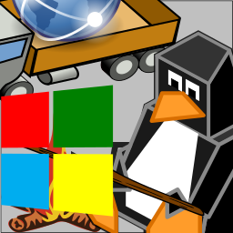

<!-- scriptedIllustrator_markup_uk4uPhB663kVcygT0q 
#exit # scriptedIllustrator_markup_uk4uPhB663kVcygT0q 
# <html style="size: letter;"> <!-- scriptedIllustrator_markup_uk4uPhB663kVcygT0q
 #!/usr/bin/env bash

# Dependencies.
# May need 'ubiquitous_bash.sh" in "$PATH".
# GNU Octave, Qalculate - usually dependency of 'calculator' scripts
# recode - usually dependency of 'markup documentation' scripts
# wkhtmltopdf - may be necessary for accurate conversion from HTML to PDF

# NOTICE: README !
# 
# 
# 
# NOTICE: README !

# CAUTION: As a user, you should have been provided a virtual machine or cloud services to run this script - 'ubiquitous bash' provides functions to ease the use of either and both. An SELinux, AppArmor, unprivileged ChRoot, or similar context may be acceptable as well. Routinely modifying, sharing, and running code, may otherwise put both users and organizations at possibly unnecessary risk.

# Copyright and related rights only waived via CC0 if all specified conditions are met.
# *) EITHER, a single file directly output from 'scriptedIllustrator' (which is GPLv3 licensed), OR, not otherwise claimed under other any copyright license.
# *) Is a documentation script including this message which also predominantly creates or represents markup (eg. 'scriptedIllustrator.sh', 'scriptedIllustrator.html', 'scriptedIllustrator.mediawiki.txt').
# *) NOT part of a program to compress, embed, and assemble, functions and other code (waiver does NOT apply to 'tinyCompiler_scriptedIllustrator.sh' ).

# To the extent possible, related software (ie. 'tinyCompiler_scriptedIllustrator.sh' from 'scriptedIllustrator') remains otherwise copyrighted (ie. GPLv3 license).
# Specifically, please do not use 'scriptedIllustrator' code to distribute unpublished proprietary means of creating 'current_internal_CompressedFunctions' .
# Specifically, please do not misconstrue this copyright waiver to negate any copyright claimed when such a documentation script is part of another project or another copyright notice is present (ie. 'otherwise claimed').

# 'For the avoidance of doubt, any information that you choose to store within your own copy' ... 'remains yours' ... 'using' ... 'to publish content doesn't change whatever rights you may have to that content.'
# Although this project has no relation to TiddlyWiki, as stated above, vaguely similar copyright principles are expected to apply. - https://tiddlywiki.com/static/License.html

#__README_uk4uPhB663kVcygT0q_README__

_document_collect() {
# NOTICE: COLLECT

# Not necessary. Warnings about 'command not found' to 'stderr' will be ignored by script pipelines.
#! type -p 'recode' > /dev/null 2>&1 && recode() { false; }

currentByte=8

RECODE_markup_html_pre_begin=$(_safeEcho "$markup_html_pre_begin" | recode ascii..html)

export current_lorem_ipsum='Lorem ipsum dolor sit amet, consectetur adipiscing elit, sed do eiusmod tempor incididunt ut labore et dolore magna aliqua. Ut enim ad minim veniam, quis nostrud exercitation ullamco laboris nisi ut aliquip ex ea commodo consequat. Duis aute irure dolor in reprehenderit in voluptate velit esse cillum dolore eu fugiat nulla pariatur. Excepteur sint occaecat cupidatat non proident, sunt in culpa qui officia deserunt mollit anim id est laborum.'

# NOTICE: COLLECT
}

_document_main() {
#a
#b
# NOTICE: DOCUMENT
#__HEADER_uk4uPhB663kVcygT0q_HEADER__
 '_' '_t' 'Copyright (C) 2022 SoaringDistributionsLLC
See the end of the file for license conditions.
See license.txt for site_distLLC license conditions.

'
 '_' '_t' 'Resources of SoaringDistributionsLLC .'
 '_heading1' 'Soaring Distributions LLC'
if false; then true; # -->
<!-- # --><h1>Soaring Distributions LLC</h1>
<!--
fi
 '_picture' './logo_distLLC.png'
if false; then true; # -->
<!-- # -->
<!--
fi
 '_heading2' 'Markings'
if false; then true; # -->
<!-- # --><h2>Markings</h2>
<!--
fi
_t '
scriptedIllustrator_markup_uk4uPhB663kVcygT0q --><!-- # --><pre style="margin-top: 0px;margin-bottom: 0px;white-space: pre-wrap;">Please mark physical copies of Linux.

Do NOT run NVIDIA hardware with Linux and then redistribute that copy.
<!-- # --></pre><!-- scriptedIllustrator_markup_uk4uPhB663kVcygT0q
'
 '_heading2' 'Authentic Software'
if false; then true; # -->
<!-- # --><h2>Authentic Software</h2>
<!--
fi
_t '
scriptedIllustrator_markup_uk4uPhB663kVcygT0q --><!-- # --><pre style="margin-top: 0px;margin-bottom: 0px;white-space: pre-wrap;">Official publicly accessible locations of Soaring Distributions LLC are 
normally HTTPS or similarly provable sites controlled by Soaring 
Distributions LLC.

https://u298813-sub*.your-storagebox.de
https://u298813-sub7.your-storagebox.de
(hosted by Hetzner)

https://github.com/soaringDistributions
https://soaringDistributions.github.io/site_distLLC
(hosted by GitHub)

Unless officially and provably directed to do so by authorized personnel of 
Soaring Distributions LLC (ie. manager of Soaring Distributions LLC, 
mirage335), or unless the products are provably identical, Soaring 
Distributions LLC cannot reasonably guarantee similar expectations for 
products obtained from other locations.
<!-- # --></pre><!-- scriptedIllustrator_markup_uk4uPhB663kVcygT0q
'
 '_heading2' 'Products - End User'
if false; then true; # -->
<!-- # --><h2>Products - End User</h2>
<!--
fi
_t '
scriptedIllustrator_markup_uk4uPhB663kVcygT0q --><!-- # --><pre style="margin-top: 0px;margin-bottom: 0px;white-space: pre-wrap;">
Username   u298813-sub7
Password   wnEtWtT9UDyJiCGw

<!-- # --></pre><!-- scriptedIllustrator_markup_uk4uPhB663kVcygT0q
'
_r '
scriptedIllustrator_markup_uk4uPhB663kVcygT0q -->
<a href="https://u298813-sub7.your-storagebox.de/mirage335KernelBuild/linux-lts-amd64-debian.tar.gz">https://u298813-sub7.your-storagebox.de/mirage335KernelBuild/linux-lts-amd64-debian.tar.gz</a>
<!-- scriptedIllustrator_markup_uk4uPhB663kVcygT0q
'
_t '
scriptedIllustrator_markup_uk4uPhB663kVcygT0q --><!-- # --><pre style="margin-top: 0px;margin-bottom: 0px;white-space: pre-wrap;"> 
<!-- # --></pre><!-- scriptedIllustrator_markup_uk4uPhB663kVcygT0q
'
_r '
scriptedIllustrator_markup_uk4uPhB663kVcygT0q -->
<a href="https://u298813-sub7.your-storagebox.de/mirage335KernelBuild/linux-mainline-amd64-debian.tar.gz">https://u298813-sub7.your-storagebox.de/mirage335KernelBuild/linux-mainline-amd64-debian.tar.gz</a>
<!-- scriptedIllustrator_markup_uk4uPhB663kVcygT0q
'
_t '
scriptedIllustrator_markup_uk4uPhB663kVcygT0q --><!-- # --><pre style="margin-top: 0px;margin-bottom: 0px;white-space: pre-wrap;"> 
<!-- # --></pre><!-- scriptedIllustrator_markup_uk4uPhB663kVcygT0q
'
_t '
scriptedIllustrator_markup_uk4uPhB663kVcygT0q --><!-- # --><pre style="margin-top: 0px;margin-bottom: 0px;white-space: pre-wrap;"> 
<!-- # --></pre><!-- scriptedIllustrator_markup_uk4uPhB663kVcygT0q
'
_r '
scriptedIllustrator_markup_uk4uPhB663kVcygT0q -->
<a href="https://u298813-sub7.your-storagebox.de/ubcp/package_ubiquitous_bash-msw.7z">https://u298813-sub7.your-storagebox.de/ubcp/package_ubiquitous_bash-msw.7z</a>
<!-- scriptedIllustrator_markup_uk4uPhB663kVcygT0q
'
_t '
scriptedIllustrator_markup_uk4uPhB663kVcygT0q --><!-- # --><pre style="margin-top: 0px;margin-bottom: 0px;white-space: pre-wrap;"> 
<!-- # --></pre><!-- scriptedIllustrator_markup_uk4uPhB663kVcygT0q
'
_t '
scriptedIllustrator_markup_uk4uPhB663kVcygT0q --><!-- # --><pre style="margin-top: 0px;margin-bottom: 0px;white-space: pre-wrap;"> 
<!-- # --></pre><!-- scriptedIllustrator_markup_uk4uPhB663kVcygT0q
'
_r '
scriptedIllustrator_markup_uk4uPhB663kVcygT0q -->
<a href="https://github.com/soaringDistributions/ubDistBuild/raw/main/_lib/custom/package_kde.tar.xz">https://github.com/soaringDistributions/ubDistBuild/raw/main/_lib/custom/package_kde.tar.xz</a>
<!-- scriptedIllustrator_markup_uk4uPhB663kVcygT0q
'
_t '
scriptedIllustrator_markup_uk4uPhB663kVcygT0q --><!-- # --><pre style="margin-top: 0px;margin-bottom: 0px;white-space: pre-wrap;"> 
<!-- # --></pre><!-- scriptedIllustrator_markup_uk4uPhB663kVcygT0q
'
_t '
scriptedIllustrator_markup_uk4uPhB663kVcygT0q --><!-- # --><pre style="margin-top: 0px;margin-bottom: 0px;white-space: pre-wrap;"> 
<!-- # --></pre><!-- scriptedIllustrator_markup_uk4uPhB663kVcygT0q
'
_r '
scriptedIllustrator_markup_uk4uPhB663kVcygT0q -->
<a href="https://u298813-sub7.your-storagebox.de/ubDistFetch/core.tar.xz">https://u298813-sub7.your-storagebox.de/ubDistFetch/core.tar.xz</a>
<!-- scriptedIllustrator_markup_uk4uPhB663kVcygT0q
'
_t '
scriptedIllustrator_markup_uk4uPhB663kVcygT0q --><!-- # --><pre style="margin-top: 0px;margin-bottom: 0px;white-space: pre-wrap;"> 
<!-- # --></pre><!-- scriptedIllustrator_markup_uk4uPhB663kVcygT0q
'
_r '
scriptedIllustrator_markup_uk4uPhB663kVcygT0q -->
<a href="https://u298813-sub7.your-storagebox.de/ubDistBuild/package_image.tar.xz">https://u298813-sub7.your-storagebox.de/ubDistBuild/package_image.tar.xz</a>
<!-- scriptedIllustrator_markup_uk4uPhB663kVcygT0q
'
_t '
scriptedIllustrator_markup_uk4uPhB663kVcygT0q --><!-- # --><pre style="margin-top: 0px;margin-bottom: 0px;white-space: pre-wrap;">

Installing some of these products correctly may require &#39;Run as 
Administrator&#39;, &#39;sudo&#39;, or similar.
<!-- # --></pre><!-- scriptedIllustrator_markup_uk4uPhB663kVcygT0q
'
 '_heading2' 'Products - Developer'
if false; then true; # -->
<!-- # --><h2>Products - Developer</h2>
<!--
fi
_r '
scriptedIllustrator_markup_uk4uPhB663kVcygT0q -->
<a href="https://xkcd.com/949/">
<!-- scriptedIllustrator_markup_uk4uPhB663kVcygT0q
'
 '_picture' 'https://imgs.xkcd.com/comics/file_transfer.png' '240px'
if false; then true; # -->
<!-- # -->
<!--
fi
_r '
scriptedIllustrator_markup_uk4uPhB663kVcygT0q -->
</a>
<!-- scriptedIllustrator_markup_uk4uPhB663kVcygT0q
'
_t '
scriptedIllustrator_markup_uk4uPhB663kVcygT0q --><!-- # --><pre style="margin-top: 0px;margin-bottom: 0px;white-space: pre-wrap;">
Username   u298813-sub7
Password   wnEtWtT9UDyJiCGw

<!-- # --></pre><!-- scriptedIllustrator_markup_uk4uPhB663kVcygT0q
'
_r '
scriptedIllustrator_markup_uk4uPhB663kVcygT0q -->
<a href="https://u298813-sub7.your-storagebox.de/">https://u298813-sub7.your-storagebox.de/</a>
<!-- scriptedIllustrator_markup_uk4uPhB663kVcygT0q
'
_t '
scriptedIllustrator_markup_uk4uPhB663kVcygT0q --><!-- # --><pre style="margin-top: 0px;margin-bottom: 0px;white-space: pre-wrap;"> 
<!-- # --></pre><!-- scriptedIllustrator_markup_uk4uPhB663kVcygT0q
'
_r '
scriptedIllustrator_markup_uk4uPhB663kVcygT0q -->
<a href="https://github.com/soaringDistributions">https://github.com/soaringDistributions</a>
<!-- scriptedIllustrator_markup_uk4uPhB663kVcygT0q
'
_t '
scriptedIllustrator_markup_uk4uPhB663kVcygT0q --><!-- # --><pre style="margin-top: 0px;margin-bottom: 0px;white-space: pre-wrap;"> 
<!-- # --></pre><!-- scriptedIllustrator_markup_uk4uPhB663kVcygT0q
'
_t '
scriptedIllustrator_markup_uk4uPhB663kVcygT0q --><!-- # --><pre style="margin-top: 0px;margin-bottom: 0px;white-space: pre-wrap;"> 
<!-- # --></pre><!-- scriptedIllustrator_markup_uk4uPhB663kVcygT0q
'
_r '
scriptedIllustrator_markup_uk4uPhB663kVcygT0q -->
<a href="https://u298813-sub7.your-storagebox.de/mirage335TechArchive_discImages/">https://u298813-sub7.your-storagebox.de/mirage335TechArchive_discImages/</a>
<!-- scriptedIllustrator_markup_uk4uPhB663kVcygT0q
'
_t '
scriptedIllustrator_markup_uk4uPhB663kVcygT0q --><!-- # --><pre style="margin-top: 0px;margin-bottom: 0px;white-space: pre-wrap;"> 
<!-- # --></pre><!-- scriptedIllustrator_markup_uk4uPhB663kVcygT0q
'
_t '
scriptedIllustrator_markup_uk4uPhB663kVcygT0q --><!-- # --><pre style="margin-top: 0px;margin-bottom: 0px;white-space: pre-wrap;"> 
<!-- # --></pre><!-- scriptedIllustrator_markup_uk4uPhB663kVcygT0q
'
_t '
scriptedIllustrator_markup_uk4uPhB663kVcygT0q --><!-- # --><pre style="margin-top: 0px;margin-bottom: 0px;white-space: pre-wrap;">
https://u298813-sub7.your-storagebox.de/mirage335KernelBuild/linux-lts-amd64
-debian.tar.gz
<!-- # --></pre><!-- scriptedIllustrator_markup_uk4uPhB663kVcygT0q
'
_t '
scriptedIllustrator_markup_uk4uPhB663kVcygT0q --><!-- # --><pre style="margin-top: 0px;margin-bottom: 0px;white-space: pre-wrap;">
https://u298813-sub7.your-storagebox.de/mirage335KernelBuild/linux-mainline-
amd64-debian.tar.gz
<!-- # --></pre><!-- scriptedIllustrator_markup_uk4uPhB663kVcygT0q
'
_t '
scriptedIllustrator_markup_uk4uPhB663kVcygT0q --><!-- # --><pre style="margin-top: 0px;margin-bottom: 0px;white-space: pre-wrap;"> 
<!-- # --></pre><!-- scriptedIllustrator_markup_uk4uPhB663kVcygT0q
'
_t '
scriptedIllustrator_markup_uk4uPhB663kVcygT0q --><!-- # --><pre style="margin-top: 0px;margin-bottom: 0px;white-space: pre-wrap;">
https://u298813-sub7.your-storagebox.de/ubcp/
<!-- # --></pre><!-- scriptedIllustrator_markup_uk4uPhB663kVcygT0q
'
_t '
scriptedIllustrator_markup_uk4uPhB663kVcygT0q --><!-- # --><pre style="margin-top: 0px;margin-bottom: 0px;white-space: pre-wrap;">
https://u298813-sub7.your-storagebox.de/ubcp/package_ubiquitous_bash-msw-rot
ten.7z
<!-- # --></pre><!-- scriptedIllustrator_markup_uk4uPhB663kVcygT0q
'
_t '
scriptedIllustrator_markup_uk4uPhB663kVcygT0q --><!-- # --><pre style="margin-top: 0px;margin-bottom: 0px;white-space: pre-wrap;">
https://u298813-sub7.your-storagebox.de/ubcp/package_ubcp-core.7z
<!-- # --></pre><!-- scriptedIllustrator_markup_uk4uPhB663kVcygT0q
'
_t '
scriptedIllustrator_markup_uk4uPhB663kVcygT0q --><!-- # --><pre style="margin-top: 0px;margin-bottom: 0px;white-space: pre-wrap;"> 
<!-- # --></pre><!-- scriptedIllustrator_markup_uk4uPhB663kVcygT0q
'
_t '
scriptedIllustrator_markup_uk4uPhB663kVcygT0q --><!-- # --><pre style="margin-top: 0px;margin-bottom: 0px;white-space: pre-wrap;">
https://github.com/soaringDistributions/ubDistBuild/raw/main/_lib/custom/pac
kage_kde.tar.xz
<!-- # --></pre><!-- scriptedIllustrator_markup_uk4uPhB663kVcygT0q
'
 '_page'
if false; then true; # -->
<!-- # -->
 

<!--
fi
 '_heading2' 'Other'
if false; then true; # -->
<!-- # --><h2>Other</h2>
<!--
fi
_t '
scriptedIllustrator_markup_uk4uPhB663kVcygT0q --><!-- # --><pre style="margin-top: 0px;margin-bottom: 0px;white-space: pre-wrap;">
Username   u298813-sub10
Password   OJgZTe0yNilixhRy

<!-- # --></pre><!-- scriptedIllustrator_markup_uk4uPhB663kVcygT0q
'
_r '
scriptedIllustrator_markup_uk4uPhB663kVcygT0q -->
<a href="https://u298813-sub10.your-storagebox.de/">https://u298813-sub10.your-storagebox.de/</a>
<!-- scriptedIllustrator_markup_uk4uPhB663kVcygT0q
'
_t '
scriptedIllustrator_markup_uk4uPhB663kVcygT0q --><!-- # --><pre style="margin-top: 0px;margin-bottom: 0px;white-space: pre-wrap;">

Public files not officially at a &#39;release&#39; directory may be 
automatically generated, mostly for diagnostics. Usually, not expected 
useful for developer or end user. Completeness and notability may not be 
expected.
<!-- # --></pre><!-- scriptedIllustrator_markup_uk4uPhB663kVcygT0q
'
 '_' '_page'
 '_heading2' 'Usage'
if false; then true; # -->
<!-- # --><h2>Usage</h2>
<!--
fi
_t '
scriptedIllustrator_markup_uk4uPhB663kVcygT0q --><!-- # --><pre style="margin-top: 0px;margin-bottom: 0px;white-space: pre-wrap;">
Files may be downloaded from command-line.
<!-- # --></pre><!-- scriptedIllustrator_markup_uk4uPhB663kVcygT0q
'
 '_o' '_messagePlain_probe' 'wget --user u298813-sub7 --password wnEtWtT9UDyJiCGw &#39;https://u298813-sub7.your-storagebox.de/file&#39;'
if false; then true; # -->
<!-- # --><pre style="-webkit-print-color-adjust: exact;background-color:#848484;margin-top: 0px;margin-bottom: 0px;white-space: pre-wrap;">
<!-- # --> wget --user u298813-sub7 --password wnEtWtT9UDyJiCGw &#39;https://u298813-sub7.your-storagebox.de/file&#39;
<!-- # --></pre>
<!--
fi
 '_o' '_messagePlain_probe' 'axel -H "Authorization: Basic "$(echo -n "u298813-sub7:wnEtWtT9UDyJiCGw" | openssl base64) &#39;https://u298813-sub7.your-storagebox.de/file&#39;'
if false; then true; # -->
<!-- # --><pre style="-webkit-print-color-adjust: exact;background-color:#848484;margin-top: 0px;margin-bottom: 0px;white-space: pre-wrap;">
<!-- # --> axel -H "Authorization: Basic "$(echo -n "u298813-sub7:wnEtWtT9UDyJiCGw" | openssl base64) &#39;https://u298813-sub7.your-storagebox.de/file&#39;
<!-- # --></pre>
<!--
fi
_t '
scriptedIllustrator_markup_uk4uPhB663kVcygT0q --><!-- # --><pre style="margin-top: 0px;margin-bottom: 0px;white-space: pre-wrap;">

Please use &#39;wget&#39; . Beware &#39;axel&#39; is STRONGLY DISCOURAGED 
for shell scripts - may not be available, may overwhelm servers with 
parallel downloads, and may severely degrade network latency backoff 
algorithms.
<!-- # --></pre><!-- scriptedIllustrator_markup_uk4uPhB663kVcygT0q
'
 '_heading2' 'Plain Text'
if false; then true; # -->
<!-- # --><h2>Plain Text</h2>
<!--
fi
_t '
scriptedIllustrator_markup_uk4uPhB663kVcygT0q --><!-- # --><pre style="margin-top: 0px;margin-bottom: 0px;white-space: pre-wrap;">An essentially plain text copy of this document is normally available as 
&#39;README.sh.out.txt&#39; , generated by &#39;scriptedIllustrator&#39;.

Assistive technologies may be able to more usefully parse this.
<!-- # --></pre><!-- scriptedIllustrator_markup_uk4uPhB663kVcygT0q
'
 '_heading2' 'Free/Libre and Open Source Software (FLOSS)'
if false; then true; # -->
<!-- # --><h2>Free/Libre and Open Source Software (FLOSS)</h2>
<!--
fi
_t '
scriptedIllustrator_markup_uk4uPhB663kVcygT0q --><!-- # --><pre style="margin-top: 0px;margin-bottom: 0px;white-space: pre-wrap;">Most if not all software from Soaring Distributions LLC is Free/Libre and 
Open Source Software.

Please see included software licenses.

Distributing individual files or pieces of files without other relevant 
information (ie. without corresponding source code) may not be possible.

Some software may be created by Soaring Distributions LLC manager, 
mirage335, for and on behalf of Soaring Distributions LLC.
<!-- # --></pre><!-- scriptedIllustrator_markup_uk4uPhB663kVcygT0q
'
 '_heading2' 'Sponsoring'
if false; then true; # -->
<!-- # --><h2>Sponsoring</h2>
<!--
fi
_t '
scriptedIllustrator_markup_uk4uPhB663kVcygT0q --><!-- # --><pre style="margin-top: 0px;margin-bottom: 0px;white-space: pre-wrap;">
Soaring Distributions LLC may not have much to give, but those who ease 
moving virtual machine disk images and such, or reduce to need to do so, 
are very greatly appreciated, and very relevant to the purpose of Soaring 
Distributions LLC as well as to users of its products. Soaring 
Distributions LLC normally regards such as charitable contributions that 
are expected to reduce its own risks from fewer than desired affordable 
(ie. $$$/GB transferred and $$$/GB stored) file transfer resources. Soaring 
Distributions LLC is also concerned about end-users having sufficiently 
usable file transfer resources for their own use and modification of 
products. Soaring Distributions LLC recoginzes it is part of a technology 
ecosystem, which must remain healthy.

<!-- # --></pre><!-- scriptedIllustrator_markup_uk4uPhB663kVcygT0q
'
_r '
scriptedIllustrator_markup_uk4uPhB663kVcygT0q -->
<a href="https://github.com/orgs/soaringDistributions/sponsoring">https://github.com/orgs/soaringDistributions/sponsoring</a>
<!-- scriptedIllustrator_markup_uk4uPhB663kVcygT0q
'
_t '
scriptedIllustrator_markup_uk4uPhB663kVcygT0q --><!-- # --><pre style="margin-top: 0px;margin-bottom: 0px;white-space: pre-wrap;">

*) Croc ( https://github.com/schollz ) is especially appreciated for the 
ability to immediately transfer such things as shell scripts, installers, 
or maybe even occasional compressed VirtualMachine images.
<!-- # --></pre><!-- scriptedIllustrator_markup_uk4uPhB663kVcygT0q
'
 '_page'
if false; then true; # -->
<!-- # -->
 

<!--
fi
 '_heading2' 'Script Consumers'
if false; then true; # -->
<!-- # --><h2>Script Consumers</h2>
<!--
fi
_t '
scriptedIllustrator_markup_uk4uPhB663kVcygT0q --><!-- # --><pre style="margin-top: 0px;margin-bottom: 0px;white-space: pre-wrap;">Some scripts may download products of Soaring Distributions LLC for 
internal use, developers, end users, etc. If public services of Soaring 
Distributions LLC change, adding such new upstream information may be 
necessary. Some of these may be known to and/or used by Soaring 
Distributions LLC internally.

*) ubiquitous_bash - 
ubiquitous_bash/_lib/kit/install/cloud/cloud-init/zRotten/zMinimal
*) https://github.com/soaringDistributions/ubDistFetch
*) https://github.com/soaringDistributions/ubDistBuild
<!-- # --></pre><!-- scriptedIllustrator_markup_uk4uPhB663kVcygT0q
'
 '_heading2' 'Safety'
if false; then true; # -->
<!-- # --><h2>Safety</h2>
<!--
fi
_t '
scriptedIllustrator_markup_uk4uPhB663kVcygT0q --><!-- # --><pre style="margin-top: 0px;margin-bottom: 0px;white-space: pre-wrap;">Pre-built disk images are a last resort, mostly for diagnostics with 
physical access and for embedded. If your cloud provider has 
&#39;cloud-init&#39; or similar, prefer that, instead of pre-built 
desktop/VM disk images.

Passwords, SSH identity, OpenSSL self-signed certificates, etc, may not be 
different for copies of pre-built images, in spite of some efforts by 
Soaring Distributions LLC to remove such. Change if this may be an issue 
(ie. if network login may be possible through SSH, CUPS, SAMBA, etc). 
Scripts (ie. &#39;rotten_install.sh&#39; by manager &#39;mirage335&#39;) 
may be able to set these randomly.

Passwords may be set randomly, to disable login except by autologin or 
cloud provider. Locking a desktop session (eg. with "Ctrl+Alt+L") may not 
be easily reversible.
<!-- # --></pre><!-- scriptedIllustrator_markup_uk4uPhB663kVcygT0q
'
 '_page'
if false; then true; # -->
<!-- # -->
 

<!--
fi
 '_heading2' 'NVIDIA'
if false; then true; # -->
<!-- # --><h2>NVIDIA</h2>
<!--
fi
_t '
scriptedIllustrator_markup_uk4uPhB663kVcygT0q --><!-- # --><pre style="margin-top: 0px;margin-bottom: 0px;white-space: pre-wrap;">Users of NVIDIA hardware may require an internet connection or similar 
convenience to download software, may have to run software theirselves, and 
by running that software, may create resulting software that is not 
distributable.

A syscall exception may be what allows distribution of NVIDIA proprietary 
binary Linux modules at all. Or, so long as NVIDIA can dubiously claim 
their proprietary binary driver for Linux may not be a derived work of a 
GPLv2 licensed Linux kernel, NVIDIA may argue that an &#39;attempt 
otherwise to&#39; &#39;sublicense&#39; the Linux kernel has not occurred, 
and thus NVIDIA may claim their rights did not yet &#39;automatically 
terminate&#39;. Supplementing that, NVIDIA may claim the structure of their 
proprietary binary driver for Linux makes only the compiled combination of 
Linux kernel, &#39;glue layer&#39;, and proprietary binary blob a derived 
work of Linux and not distributable.

A United States court might usefully settle this continuing derived work 
GPLv2 copyright issue, which apparently has not been raised as of 2022.

Apparent absence of distribution of LiveCD/LiveUSB images with NVIDIA 
drivers precompiled is strong evidence of a consensus demonstrating 
obviousness the compiled combination of Linux kernel, &#39;glue layer&#39;, 
and proprietary binary blob, is definitely a derived work of Linux and is 
definitely NOT distributable.

Meanwhile, Soaring Distributions LLC attempts to at least follow best usual 
(eg. commercial) practices, or better.

Soaring Distributions LLC is at least reluctant if not unwilling to itself 
distribute software which includes what may be found derived works that 
create binary Linux kernel modules. Soaring Distributions LLC does NOT 
expect to ever have itself distributed a compiled combination of Linux 
kernel, &#39;glue layer&#39;, proprietary binary blob, etc.

COMPLAINTS should NOT be directed to Soaring Distributions LLC. Neither 
Soaring Distributions LLC nor manager mirage335, caused or intended to 
cause, any &#39;attempt otherwise to&#39; &#39;sublicense&#39; the Linux 
kernel. Instead, send such complaints to responsible parties who may have 
made the &#39;attempt otherwise to&#39; &#39;sublicense&#39; the Linux 
kernel in violation of the GPLv2 copyright license, or may have knowingly 
caused others to do so (eg. at least NVIDIA, complicit distributors 
including Debian, Ubuntu, OEMs, etc).

To the extent legally possible, Soaring Distributions LLC should be 
reasonably expected to publish, and specifically make relevant 
third-parties aware of, any such notices.

Soaring Distributions LLC may not yet on its own have sufficient 
information, understanding, knowledge of precedent, or representation, to 
prove, but does not discount, that responsible parties (eg. at least 
NVIDIA, complicit distributors including Debian, Ubuntu, OEMs, etc) 
committed or knowingly caused coercive, flagrant, willful, commercially 
gainful to the extent of many years and multiple billions of dollars, 
violation of the GPLv2 copyright license of the Linux kernel. Soaring 
Distributions LLC however, far downstream of those originating 
distributors, itself benefiting from and using the protections of GPL/AGPL 
copyright license, having no expected interest in weakening those 
protections, is at most a victim, not in any way a knowing cause of GPLv2 
copyright violation.

If Soaring Distributions LLC distributes software which users may run to 
receive and run software from third-party distributors, which may create 
not distributable software, and if this is perceived as some issue, any 
&#39;cease-and-desist&#39; should then in that case be sent directly to 
relevant third-party distributors (ie. NVIDIA, Debian, Ubuntu, OEMs, etc), 
NOT to Soaring Distributions LLC itself.
<!-- # --></pre><!-- scriptedIllustrator_markup_uk4uPhB663kVcygT0q
'
 '_' '_page'
 '_heading2' 'Reference'
if false; then true; # -->
<!-- # --><h2>Reference</h2>
<!--
fi
_t '
scriptedIllustrator_markup_uk4uPhB663kVcygT0q --><!-- # --><pre style="margin-top: 0px;margin-bottom: 0px;white-space: pre-wrap;">https://en.wikipedia.org/wiki/Series_of_tubes

https://xkcd.com/949/
	&#39;I like how we&#39;ve had the internet for decades, yet 
&quot;sending files&quot; is something early adopters are still figuring 
out how to do.&#39;
		Still very much an issue in 2022. Is there really a good 
reason for that?

https://xkcd.com/license.html
	&#39;Creative Commons Attribution-NonCommercial 2.5 License.&#39;

https://github.com/dutchcoders/transfer.sh/issues/181
	Apparently the limit was reduced from unlimited, to 10GB, to 1GB, 
to <<1GB, specifically to prevent &quot;sending files&quot; . Does the 
absence of such basic internet functionality for developers really benefit 
anyone?

https://github.com/schollz/croc/issues/437
	&#39;Croc freezes/stalls during large file transfer&#39;

https://github.com/schollz/croc/issues/453

http://ipw2100.sourceforge.net/firmware_faq.php

https://en.wikipedia.org/wiki/Open_source_license_litigation
https://slashdot.org/story/06/05/14/2059242/kororaa-accused-of-violating-gpl
	&#39;When someone takes that same compiled glue plus binary module 
and distributes them, they&#39;re distributing a derived work of Linux, 
without complying with the terms of the GPL, and therefore without 
permission to distribute under copyright law. &#39;

https://www.gnu.org/licenses/old-licenses/gpl-2.0.html
https://www.quora.com/Are-lifetime-contracts-legal
	&#39;lifetime contracts&#39; &#39;unconscionable&#39;

https://en.wikipedia.org/wiki/Free_and_open-source_graphics_device_driver#AT
I_and_AMD
https://en.wikipedia.org/wiki/GNU_General_Public_License#Linking_and_derived
_works
https://tldp.org/HOWTO/Module-HOWTO/copyright.html
https://arstechnica.com/information-technology/2006/12/8428/

https://gitweb.gentoo.org/repo/gentoo.git/tree/x11-drivers/nvidia-drivers/nv
idia-drivers-510.60.02.ebuild
http://gpo.zugaina.org/AJAX/Ebuild/53561524/View
	&#39;SRC_URI&#39; 
&#39;https://us.download.nvidia.com/XFree86/Linux-x86_64/${PV}/NVIDIA-Linux-
x86_64-${PV}.run&#39;
		ie. 
https://us.download.nvidia.com/XFree86/Linux-x86_64/510.60.02/NVIDIA-Linux-x
86_64-510.60.02.run

https://wiki.gentoo.org/wiki/NVIDIA/nvidia-drivers
	&#39;wrapper functions that will compile against the Linux 
kernel&#39;

https://opensource.stackexchange.com/questions/1477/do-i-have-to-disclose-th
e-source-code-of-a-linux-driver-i-have-not-developed
	&#39;But, if the driver doesn&#39;t directly link to the kernel, 
that may not apply. I remember in the past some graphics drivers (I think 
NVidia, but aren&#39;t sure) had two parts. One GPL-part included in the 
kernel and offering an interface for the second part, that was proprietary. 
I don&#39;t know how legally stable this construct is, but it may work.&#39;

https://www.kernel.org/doc/html/latest/process/license-rules.html
	&#39;GPL-2.0, with an explicit syscall exception&#39;

https://www.nvidia.com/en-us/drivers/geforce-license/
	&#39;Linux/FreeBSD Exception. Notwithstanding the foregoing terms 
of Section 2.1.1, SOFTWARE designed exclusively for use on the Linux or 
FreeBSD operating systems, or other operating systems derived from the 
source code to these operating systems, may be copied and redistributed, 
provided that the binary files thereof are not modified in any way (except 
for unzipping of compressed files).&#39;

https://packages.debian.org/es/bullseye/firmware-ipw2x00
https://packages.debian.org/es/bullseye/arm/firmware-ivtv
<!-- # --></pre><!-- scriptedIllustrator_markup_uk4uPhB663kVcygT0q
'
 '_' '_page'
 '_heading2' 'Copyright'
if false; then true; # -->
<!-- # --><h2>Copyright</h2>
<!--
fi
_t '
scriptedIllustrator_markup_uk4uPhB663kVcygT0q --><!-- # --><pre style="margin-top: 0px;margin-bottom: 0px;white-space: pre-wrap;">
This file is part of site_distLLC

site_distLLC is free software: you can redistribute it and/or modify
it under the terms of the GNU Affero General Public License as published by
the Free Software Foundation, either version 3 of the License, or
(at your option) any later version.

site_distLLC is distributed in the hope that it will be useful,
but WITHOUT ANY WARRANTY; without even the implied warranty of
MERCHANTABILITY or FITNESS FOR A PARTICULAR PURPOSE.  See the
GNU Affero General Public License for more details.

You should have received a copy of the GNU Affero General Public License
along with site_distLLC  If not, see &lt;http://www.gnu.org/licenses/&gt;.
<!-- # --></pre><!-- scriptedIllustrator_markup_uk4uPhB663kVcygT0q
'
 '_' '_t' '

'

#__FOOTER_uk4uPhB663kVcygT0q_FOOTER__
# NOTICE: DOCUMENT
#y
#z
echo -e '\n\n'
}

# NOTICE: Overrides - new functions .

# NOTICE: Overrides - new functions .

#####Functions. Some may be from 'ubiquitous bash' .
#_compressedFunctions_uk4uPhB663kVcygT0q_compressedFunctions_uk4uPhB663kVcygT0q_compressedFunctions_uk4uPhB663kVcygT0q_compressedFunctions
current_internal_CompressedFunctions_bytes="12399"
current_internal_CompressedFunctions_cksum="368845939"
current_internal_CompressedFunctions="
/Td6WFoAAATm1rRGAgAhARwAAAAQz1jM4ceNI9ZdAC+ciKYksL89qRi90TdMvSwSEM6J8ipM2rR/Iqc/oYbShD5P+hKgz3ONSu7BhrUf8OSN4oZ8BL1e7m0JQ33pEQs007VTHA7nLczyIuWiilZSo+0zB132
DrV189uAlZ6oqD3MK7bjrSmuGreEaBOC+z5QkGUPIDVaXfJmDg73/A1Y9JqRKxtli7ZDurfX2t/Z3m6RV6ku3LwPHl2qt8/kbWEubRkY3Fl2VTTFWjQ8Z9qfpBK4YyV7fw3X3hcUmN6Fz+u2P8eCSl/fCnNX
HtvGeiwoJbZ3wje2iPvqVhHoy0BMVkEDcSqWo+znkV0BwqE45qLsZQ9IGG1CzglgciwcOU2fdsqKBFC5XA3WYFGg6uZ2q4mvn5jWR+FbeUz7YjupLAvLl7DE+daOBWzzyYeFrcMhDk1QeqOKpv41V0GTTqAm
Z7lRbPrhk3oRY/kBiQGZSfRuxTSmIc1zevrFy6JWcZkCJayU/wQ+XEKdvF51XHH+OYrSuhIxvk6G+Ce0sbTr3GBfVRQYdRpxeOs48xNaEfmBf6GZcWUMx5L3LA4cup19vL4O75JjKbnlJeYdoRCjtcPE7A8S
82KbKVXWm5n1ADflKsnTX3CVTSu7uS4pVXHlludUnC/0dCPIaO2WxpZTXETnBW0SD0f3HTs7UDEzwk7eMHnoe3xk/cdsh16yyG0jPOBLHEqULsotf/cimpgvkZlFxPNFKvrB2sVBDpjr393u8l5sSqQ9L5Vr
QgGi6nBnxhDESgC1fMuEusvr6Sli1rR/+c0ap1SksGpO2TEUmhLB2btBz2JAuC6RRnqPSeJB5e7Ye3lLZgz7qHahujxIhELZ6Ig37WMvcLn/BMoXxtrpqAx3WQEFwPU+GEqAYIYrxdNFO0vmXqIu7mijEGNN
3Kz52PfEP9wuiJegjzcwG1SjieemTZAy5HeBzXmyNh8NuIdpHzxX83tVQ6zn4W8eFh94YUkd8LPxqapxW9+5Ljru6KBXErt6eoQ1JzryMghYRXroIw6cezM5nO29ERbDgwMaWHM8HHSnsRVwOyHrn3h6dSYW
FRI5yIxuHcZpSxIl+Wcyy7l04D052ZLSwIr3bVXp4Wl8UN43ZjFk500/N03EAhnaDm33ejErcZzg3IyCf9KDULz2vjN1ZMLj0f8szC8Yd5LbbQJ0QaXtts9dioTUAtjmI2n0Nua2iP8U6I2yFW4q1flLmWgw
dwxuvholhSJhoQ1mvtYG9GHKOnerwBFiSgokDlXpGx/wWLEggdJzD83Gsc970UUKaPclxZq9t53+B7POZLqRi9MT1bN4M5xVNF9BpfIOMoXjjfCBdMsMg9KiWzl5MampEj+sO3zuoQacK51dsC8fF1kx/Ipo
T0+57cS1KCKaDzB3/U2HEY855HTDewfULt1Mox+DjNi+SoyNEej/2dvZj2k7gc6F2P4cYp0XlGset9wxtH8+3HkTBns+M9aR3+kzI/CW6vSnkHXti9l/usvJEofd55FM+ZveKRq4OmWB9Oq1ruDmZeB3ti5H
l9Be+OF5pyJ7O4nKeKvq36QuxgvvKFuWDH8YrEDrrLKvQA2ZwqPfB/Dx301jgKu2lHwCC5Cr6asX/Tjo71N7833otVOmbW18/ev2R0aUgZKsqzPZIqFX1x9DpRggWTuQOX49oKJA3lS+k80eCsgjWZ3NwHHB
JNS03KTfjGNYL21M5FopczHLlOKA3NfxtRVtvC3ptJwtqiQYiRhRFdiUmrckYzPNf/WZmL6FouTxTXHf/8KnqYdZ0a/shLqxbCEkIwYD7IZlBIXfZukhiP6kefFP2XGAvV7HC93XH3BC1oYnPQBRcKtLLn5C
zda+MyZGKU7AXhq1EleGh62Y/vDec7Bgz3UwJtR+8YBCdQ8/Xcf4mORqcw5ELeSC/sZESq/ZT4uHAWXlbxnvzRXvDJ58sFyghbkx9mNwpWRFrj39Hq3TTm9NkSX/ExPFblReiwO3+1d5czQOEU8JnpKwbXak
iZTSx0rJ6xz5YqpuDxrnSOA9Ti+KiK6yFVv5gZJsPa9opyNifSPEsLjaULtj3MT0jHSHlwYMPOm3ZU5anWZ9zLnlZDFk+5W9aVR/+HHjmTDgYiD/2lVhvyGFs0RFnIjj0W1Yrr0Qh7RR/STZo3Uj4PsS01jS
XFU1MAfvrY5cOFVq3gGq/BcYNU22RhC4TjfS9SLCd9Rrp8795lN2bSnGVKQ7eCrYdqYvCzLQ5RjV/jRfze8GD8XuJfOitXktggA4TGfdN2an12568jtS+q125ACbgQsG6KbDJ6HDEIk7PfdymVGeLNP58IfV
Ti9a8Wv3gxx1o9cP105zLp3eY+BXgXxpJpM0PwQ9C6SDYTYgWhLyJIL3s80HCWKRoNzfKE5+FpmuIodKb6nrgjQM2iMrkzD1grRPrIweqC2IvgUUp76cXjIWapPPJKoRAis9rOzsqZfOqwe4dCaJPjS7hodF
HOUHrNeKwCtOP73IH4yMLIWcTQkcR4cH2ycD+GoyrsM1KfK8rRf1sA2exEaj1gBbL2X90zTFijyIQp5ACcTa7g2erPu7xNzRNLL4lcAtRuduONBy7H3bokwhxUVT9XYKK6vxOsGBN9rqJ32dBCki2eznhSvG
YY7hDmldozOVzv70Ht4XupfIlhujDJ4CAVyp20SPKzFsyuI5O47AKB7bJ6KeNvsN3dn8PJFniSfpCxiksP4mSGD6c4fFUOKU1sqta3v8sgkEZIxqjtcEVkfWMvK6fVIb6z66P2kDSqBE++icHbYkIr+dczrx
6GLgOXvNFml1WJUyhpmyhkIJzZ/geu6ET9wonX4MZ/NEmC8jxUNFR/hfM+yH2sYL+1K4zI+kNhe0+iPdJYSpbxC3hOlYg5wsF0a72YOfikpkwp+2SdL5ItnyCkVTqMJVpDMSDppFsb1IcSm3oVLlTCOYpQxi
xNDpvrwfzm5INJXutfAgTnsuAAcaEIojAwo9N/+SBWcckzuXDR4OwDi3RV1muOvBjokJxIdAPtWJ+uNEVP0lXh+h0NtQ7ef04SfuYp9LQG1xMkglcvFZ44jp/L5G4NN4WnJJhKab539tSqdbMdDrRiLrsuC4
KjR5btxXS1fZMl/1Xv4pA2SSAavd2VCr1uFRicajnanO8cy48yJGoBNI2W+6In/H5QFwEGi2x7UwEGSFuBn4GlaAiNK7uZDg+hXZygCn03CgvwLsv8MlAfzwG4PVTud+3drmDH1VT1yj/KyUtTuOzC5kwkej
Plm+nWsvIllEV4RpSnA6qxpIM0pqtzYHJkIrk/avJj5RI/48SfDusDhiPCfuNHbuTXqP5Icg+Yy7Haw7JJpzFPHRxVHeNkeDda5D2/izDV9jfczVhajB7YI9W9kn8R56FgHKnNRRj5zE3APEx/Z1cNfZO9QE
w4/T2inDLxP/cS4uorgGK7SJ774XgChWl2DOeU935l13Zn1au8GEP79SKmiiTUuTLYNp9NE4Qszk4tMmoKHXAlV/FU1UzZ81lHdMQAJD5bPf0UYD6Xwm+AEWf2ZE38zLWp/AsFCUfR19vZSqc+exrFoEyoCe
PwMJTQ36wTcP39xZqZieI8gCRT7CmM5HQZr7yqhOsspirM7uQREOEtDrI263hGlL7BpuLLXRAmmtLxuaZmk8ZCONzADTvaZVzltbT+0UEOsnJg2oGb1NwQCZMiUiGZAAdGuUhmKDBm9puMYdNt/yld9tDIwv
oAPIHCv7i5rk5Sxj7f/TmPrNS9F/ijEjMvLhXrIhHyKXqATIhhx61wp4Jc9vECgih7fJjHH9E3IB5aJO83A2r6TwMIUAWVj0LwEZiHn6iwFoHU/rXn4dLtaJJVs6C/M7lsNIbiJokfN0sC8alQlNegzsu2RF
5ERNRi7E+g1pVyHwf06wpuqyadn+v+D+LgN7eeqOnZH3gvjuKeznOvCR9nCJi8aysblRejmLOLGuxFsxWyhLSveK+EQwJXluuxj9Kuh4RbCfzWzSGFG2dD5Vpn9zTND3/xtO8ZlK/oVn76f+CQd5HSCEHCOb
6xkPXLS9mISFXny2cSF7BjGETunl6gQCzVFWJLO4JOL97XneV209AFCHRRF3awzrjjyUtCpiClInBHidhgG9M4YZaFSqexkSpOujl6JxFLR8Jbvl3dY6haZWCyaoXCg+CLhCDauyh4pmzH3wbQCmuohvrLLL
LjjG+TkHd3nNj70i1Jd7lAy3pTR+tv+zKndeqKyzl+RIjjM6SWJrzpmpJiZlNlUqGRo/4ZeYIQTlYSPah/V+00rl4BdP2Wm7B7BbELIF6gyp7qpukhHG75lZj9yuf1u8OzIO9XP9uj/+zdm2TKVm3o1xW08m
RDcKl/Bj+FLxY1GN4bAEzZsBD5hdWG6DNuY1CHoMyjnY+aamd1sV08cprLjR/MxD3+0bnOloLzh6B0ciRdnd923890+QvN3abt+ua4zpgGVcmB2G8wpYIwuMtKt2OMo2h7Ks1uMR0JKIoUZ5vCrQWr3PXz6b
CeMkDLgwinXZw8TLmr3HssTw9pOSecL1hUsy8UamJV2dELhIMNJMEZjS4WlvsguDDgWy227yLnn5FdoOiD+FzC+btipX71/XoFqge0p9b5UjZE6qsCnAWMRDe7EkxRuLU9BxEnT1TnPzDfXab6pbkPOLMRLO
qUIjhZ+qV+uGL0iMBd/M1C38n4CRI5u0/nKEH2jXbnZ50/yzs+A9gukvIbWYG9FtC8uFy/vbi6qEmI0n/yIznG6b4Ycquu52q1eVNlRDmFMqCHxgEWY2JXXxqUiS6xPqRkgIALywOgpOXbMHi60MSnPalEoi
/SO2J2hJ0BQvOFf1h98hEeY4Ze37HIwkIjrl0EyWv7NWnK/pLrCuaG2N3sUgj4JRN+EuxfgEHldJDoztQCOiLJPLly/qzbyyWwN360TArX6a33X9qwoLBQyDWFpN/v6BqeqZYiVRJVF5fYfQDpxTc2rNI4Jv
CWlBXGlCYqaVYT8UVXouU3I3b84jtuN+PGS2BDxTfKB1G1Yqsjjg3SveC4Ag5W3Gis4xedIrW/XgmYnaabwvLu1aRvOG0mgN7I5DzGoBAMD+Wyrc1nuuAScUMeI8VvS9p3xnBIxDeyXxkWR8rc1ei9nmLH28
e166nScoF8JMOe06z07Sfo7aAXw2fBYPorOpyzhCUJXP4KrNHK2yzPTkFi9J7THv/QOaxp2R+1z/fEdSK8LywtCN6t7KKWcBEU9FJw4t3Hiw6MfC6RJiPay9w690f5KGOHz1AX+Tt9dwR8VwfO0udQPWYlNS
CW/T1r9ZozDXXBrqklTJHLyQ3BGp1jzDOhdQMfc6RmvqAClyUsMrMRCZ+d/2anJvCvBicRV/a0GlfOxlj5+odO6pdZdqr2Y5YIxrh/jhG8EMZO+mQ+Oy3il+VZjkjdaKro8XHjXAs0o94pBRd8Fyq2Z2dZ1A
sH9qkUwyqFnNkzvB6eRzJ2jEyy90++OfmRqGc4OBotYF8kk/xoACgha5ipVUhY725SQOseGK6vYHoSKbyoxAk474IB9Jybq67MPJOFIWo603952uUY+cDym8dnP9hfGjebFxo9NTPuCnQveCi+/18KDidVDa
c5PlI/mI671906ktEe/jPHLGbvmTLH0TuZfs9e2+e7DnEbL4sMLH0EawAcwSdFYVynKM9sXRhYoLIOo7YtWWAxN6g6nSJrwPibP5+mc3OCg5c/MgAV/c4bE9Vuj0Hh4n1BDnuDM9XgACopFhtrC8+oQczaQv
cwQX4uvhNoMtxxHsbcLBBSTpLMqIELtXdYLvXVH+gZxiONeniYEnNigNGWX8zcC0uZoyen1eVQd8AEhMhBmQWsZZX3hiOPKiYvbx2/yIuzAGJtfLW69OXnQ0VvySh8ixvnGjyVjLt+fdcGNeUVsLedmAm/oU
sYu0cUTTPRgTmPhigRCWT8Lcr4i+7ksK2X6+8GBhSRroT//Vy2gVWLfpYhlH/pr14KCw9f8NBYRN8Lyq3CKBU1GdKJ73IOg0eG2BxBhjIKl2yX11MzrcqvPhmOBRbPZ4e7v/tCke/sHCEZ913nKWiFFBpVOI
rz8DJL0GIf9UqhhM0r91Ie/FarHXz2GmGzsZhkrdi0c6MimgBLJlwr8G4eB9rO2tBnCQGiOTonLV5ganns1hJEvJ41WSR15eoNjr4ro5N1K5TDMkkZXH62JYgEzJgASRxDHHhHrfJatGrk0UDZootxFnvxPk
T2gVLUIP+lqQH5A4SGKIggUFK+z7iCgVwBjkO7F1Hcu2yZ6OaNkektzlqK+EJKjhjHvnfhXUji5dVLhx6J3Btqwmt2AnG+tqu0/Tl7qmYgOEkfLg0iZXbJ+prVwGHWgxcYVdAhBD90BTMdzPsMOTLrBuSPLe
xH5gyqcL8ov1AuWxTPj0OJHFb/Ro27aNvV8B2iJlJ/HCEBETADbfe5bySe+wpYZiqB+9dN9PvqFk5Kwvrp1hNOmItxVcf1iZWrvjn9Y5HE844IIdq5UCLCh378ZznFp/0ViyY/pAbHBay1L+ZusplXPBAD81
7susYMjzCegD85Nhk9pZyFHgVKrBISqt0ZV1dKozozQ1+NCM2YpxLWFK7Y6VNouIF/FGCueSTIpEu0iKz3IFMMea8dcDoLeUCR5go7GiBNNDsp0YQhusyzVM5PodIy45k1U04P7fri93ox6BuTxmlNYkefrq
PhhjcKiFH3t5e3X3iRb2TfYdTbPcgzX+SV5MaDBRqkMIt1fohxIuI0n2kZ8K4AuVMB8fgToi+rZQCeK2hQV45YM8PjhuZ+EJ7j5uzkR1UDi3MttMj9SMukW3E9Evo6lo35KKl8ci7mTq7M+3b2jyNzsSqcs7
te0NQj1+zqsNf4X/RW8O1I3sOC+BUj/z54G8TKhnS7Rzryb0HN2dhNO7qWeQZJsLR3emLunDC5/Pcc731JFbherFuS4PVkEFR0PjV6pEbYkcCZ7FkmLpb5ZmJoEHPtrFJCCi8MgKwZyIN9tqobia/D29wlr2
vloR84laF4rZoYsKXlbZqifOkNGVFaDZhFOn8yDRixXVsAPe7i1c2/BfvecAmtZNpimVb+gOhd24zNYOS2xIbh2J00vpGIYjmExi3NtyXpBQmJxYy8QtojOwU+S362rXzjkC511SRN74coq8AbwncGz9Q3iH
AgtmQcd5TygXK9DkU4/tynWkfhPFAjcfpyn4AVAWoB7fYO8Vxxf54p8pX5l7WrjXKBWWRZCTW7vN1Zm5kmLlQ5NYR7t2Z+/Tlm0ozeSRXNbZQC/jN5pCLDYTyXQlsdQ4ZsWXh+dk84KwlH8ifZPDa1xgsukT
glpy9yggf74ImeLR7cj+01kmMK86vTYchB6Os9Vwk6nNZ1nzxjV/uclUwRoZb4JiUjOpiHyQuJQ1j/J9a1f40n+qq1W8voi/Lfnt0bm4Yzv36fPCDR7Za1xncUGB0E6np7ieRi64LVEvmHcQQlzqMDOajFbK
IlsxkNHXrS2Kak4NVPqqmc9ZUzwm3PkMKNGSCv3JO0KzeZY7GuQOBPXx+D7l0A12q7L+BGCuRCoJsTDrBEwRyDPK1IddeOYeF4+IodL1ITM4dAecuywUSjz29Bl1veuG9aa3pyYgAhuSV41PXgsfJZqbB9nj
yShdK0DO9g1a/GaLtUNoAM0KxFpDVAryKhrHUbOYlXRYiFAS1IrU4NyTvb4+6QE/hJn3WS8obmTc0PgzhNWDGWnEWNjkUh7vhMO9Ns6O2/KCjCZZuT7i2dK1LLmy1EBYrRoyPZPNVgrz3Fo1J2d1dXe9AQyY
r5U07MGDHPJGR7FD3ym12Ls7Kb23BXC6363GEKCRJa+wOuUOOROSSp5FzkUEXSiC8LRkxPQ2SPZAjw89Kz7fXRi7W8QXtHJunLTI6HFGs24EPOzFufKHx1S1sW8YlRhqeaEb6tjujAF0nVN+paxQ+9kVP6mk
Ps6qxvXhSh89GFw6SHQEGbUxtTMmJsVKywDZ2ZGur9oNN3DCNWQOuduAn3m5/z8BrsawTJ8FsbZF2Ph2AJsbQL2qe4Ar6rAIEns/rX1mKN19otGwRanyQeLqNBGhzZrtFpGkdUFz2477NyGmZP/lI/N6aIS7
BNJ1SJBvEu4Y0Vs3Cif7y9IwSeq9GcqsNSVCfuEoU0jq6LyeE4mSLwPBdDhI1mX6sKsXXsOI4XzRB/v/Xk8VO61HT0jiKlknYh9FGeIySrpA56GvJB4ieC6ro7iiL0ymSEFcdn8LFq2sU9G6gNFK8VnfIfKH
vgB9DMsq/YvSKkQLUaWCAy1SW6FPcOWB5azqveWPTllkn6jjb2NyAI7bYQ1PR6niwmX/wBchKOB6n9iO+in5GaUNtlxq6YWB2qhQbh9qeFLbxsQGGV/eMFtBl6W4z/U+AykqIQgL5fxyAJPa8TNkrzS0Biv0
/c5izWg+2ESIbZle1+S21o+SnLiCK09jFp3oltxXtinQVN39EYo1wZxUnKuOdFj5zkrcUPG9UG0gG9lgNuQi6ioHjAgooLxJRCnM1ofyQuLG3fl4GtEnXim1JVA5drPrSr4JD1gpzPC5ha9ORspvpQwxwo+8
SLsurUgPgh5HfV4bt2d7psq23Hb1BNYHIUZOFhlXiHgGRnFODmi/YeVck3Ik9DtqNZRBCioqvAEulRQ26smYhMLW7PqJAov4q2GcGXbRxXPRZFL/59r7+/dbztIEkF4pHjo/1PdZYdAdtgNhU1LSvTKRa2yu
WEsABWAXroAzULZyW1NB5CWYdxhZAFbIbsv2YoN5UvuNqogS0xOr11bylCZqE3fiVz9CrLQXP4rSu03PNPQKTGkJY4rp2LIbEtV1u7+9m10YtvTyYwjZ9UAMa+tnLrVTUzb4Xp+jHkPZUCyvJv4rCMAa3zMA
R3O6PTjh6ozF4S9krKoFCsIDxfQ/KPJ3dE4U3bHXcVngnLqMEpOjvOIAGmWHoob+EYdsRRUPRGTAJyYMF0PYSA3iiqDOAR47hfNxjxzMM0EkvsrcVO0gWDrB0tY8OFLKg0QokFKQJkKblpEl84uwZCaStdB5
WPY2ZFIMLfrMWqWzOG4rVc6g2dsRBFbIVtzkxq8x3W2brE4cgzhfjJd3AM8cyR8daaw8BXK+3JH4/nXb7A2l9+S7TSBs/nvs/lugbfCWrx0cLDLZrpBnCIZPWLe3W8rFb5YRUfjUCRf3VQXogBIE5GOW//TM
rgFxI/DWRjtQefMBFPFI/o4BZui3tGlCQ3dLyuBjV6HxdmiC+c5aZd5Hp0hAsp50vq0RtsRIBuNFM9pxSmghF8PjiKhENChQPQyryzhnuiCN/vYnmNHQ+32tRQV5erxxwwfNe1M5bWvNPaa4c0upopNskZX8
nDalHRlYKrXhJYe9UOPtL/5nAsuPAIdceRHbIb6uRVLuUSOmYSIxEm+B7hLFdIhoATtVXamu242ramIhQ1Ioy5WFV1yxXrFhCOH6plo+XgOFPaEv0InT80lmiuS8vF4EHC1eh53qJE8k0CwG7rptpqPPtMhv
qeceS8DucKq+SMel+OWXwNk27S4XYs9QiOPEfvEK8X37qDWJFZspKlTOb5bBaPO+LLqLow9MFA0bm7SJ1wDCC2OcUJJxd3DWPwOhCn1t/25pwlMNQIZAbgeoWFkmoNt0RiU4DOFzvjdGqHQKmhI/8X7cgjtz
XXUEqLUjJhie0+nj+C+b2wytKuCkQT1rMWq9sLHyUKuHk5ZXzoEeqdU1H4GaAgM7MG3qU590m5oY25sLJKo3UkXj9kzRqTfPA9o9QirGvBR8Ig/J0bSXgqYh7HG0hAlXCpS6BIzI7NrC1BMqDFs/uiOux0Rv
4YB5N6mLpUF46+hb733i7QAziVktHgXZgxWvY9WwK5prPEJK7Q8ISkWQll3jdsvqPagkEznWiBV7CzWdw8+gztlczZZTF5Bc4jhp8T3hNwLExOVMJJrW4KKnAMTfDUZe8GpXRh+yL41IOMUZjs+Guq0ojUy3
hYj6ZgvZXho4+aN5KliDFdElSHzVogH5Lbwmz45MLttDIpU04NlkU3Xuh9mWb4jY3W4GXiTgBLzVp7xNPsgDvLtk9caHubZ3xMElxORtdwD6xfVILwmaZzjL4J7+iWPmGwR02AeEckONJTcmaEQxfPR5uORS
bwR9rN2QdOjGhAphiaCwzniZFSa0k+TeFpbhAReDcsJp2+iMfNnucaJGMHNUZCZ/xPfnnf3RhKgUSUr9lUkMXEflNQxcvM5fyKFjvIJgWVVTPsvGYJQ91+Q6fFpHFZpuZpA7xNht13y+MqbdnXlLpBw4pXDt
K3mCsh8hH27lat7b8ljwX6M+zZKboxxnnJtLPqE2HC14739NOnC+atbU3U/LiIGHgUjTOTkLkutCF8Z73wSGpRA5PArkr8G1m6kL7zxYpajREZUrM2pckZwFu/6VE84HKPWYTXGzInYNaPJK7kvAfuivQkDe
i8Cw07jbQTCPQy8Ebdsm/WlJ0Hjv5XfQLCSOsyuna9nK8exaHDPsjRBTDhjk1t1qArVEvWeKpBWc0guOO4FSPdIGZMrSjmYtOMM/GqLo2vI72GQEYzosb9Z8HgYGPKZvTSYQlgVvhnaO+k6dy7zeHjWoFutV
YU4vlRqDchuGF83bJxugoOkQDa+rBoLqgZGcVaHLzneu5OTp9KSZfIhBCnfr4CVzBQaatXqewhXG90xxu8Apcw9DPmg6jsgV5DsNzlN43qzkZbXdvgIZQolVZMGra2dM6GZYdSwIjoxtHMucFF1jkWL4L2hV
4ObVHs/vCzsdg12hjbjZdVN2Su8LyvQC6CY12dc3y8OXqiVxEkTDwZ6hsFWTj7VHDtqL13koPIxb3dPtIJ4PWzUhrI/6HdXog9sm2+ZOCpzskDNumvH7H0tAzsZZ3ath2LB/mj2BRpJaorBkis/ASm8qbFh2
PPcqHMY64dM4xHsiuVMolb5PFG5SuIa0lxqnwaOJYUJDQkVGJqZhcE1R84H1J1QXHVZWDgl3hQ4wCgou65wp9MAEbT2+XUOZeXOU7Z+X3+tv9bUyanjIIUFo2fal1/1hSdO2ShTvG/GxzTLeUzS1oGpVZ6rR
T0XY8tA9uDGTdprof1GPoBIs3nYqnXBvIQWyvPLhNQ7Hokq1N1mXvbWZJcnX20EyXEdM0zChangjA797VC0B7HTreCRTT2ZEUVPh6guW9cIl/HNLHBrGKgRXBiJFLMkbkCyvOYjdK8NrzJUPs61zA1yXZsaW
7OYOR+h+11cSWM484geQNkGX5GxgMU0fbKXtcHYgFCl3vnz6cCA1jBLdLB90qgyt+WgXAbdGkF6vkEsX7oBe2f5m+j14rN9YkyinrtF6baiSBfRbz+thif/yAbFow6As+zZ3EiCivKrFX0FYtMOopXZFJD8g
kXA8gqglJpeCscDehsEWOr2lPiGzhIphwZodP5ql1tWaYpKvpO8/7dyF/AJiZIC2Td36ygbaa7OYqxA6ndkvgyV0b8O8w8Nbb1/3z7gDRRRImLftCtmgDXWv+odGBUZix0KEd3lNnxN6JFCzT1uiqnRGQh+d
IP+HjFXJT8rAY3W6/cu+t+8gGWI4vdQDKc3yp8QwR8elEvTn0PeMmDm5GM99Pr7MY9wqZvDDtjypUUWSflqe33q0b94aD/yiTfiQWBQLNeixl+IzYemuJQv8zsnCgjTXWyZ3pwQSkxPvQqXuJcXE/Al2tcIJ
FYxkcbtz+O1yF4p+C+XpwS0e70wFJupwyfyYbB6bAOUtxR4Vffa0pQPAurL4E+N4xVhQKoKgyxHh9+j+FhVph1O8HIYNDYsdQWMZhijLi2YfimBTPQOwQQPevfPTJsOPekTm9W09FSGlzMMGt6K7F2LQJ586
4qfzlprmelZCATSV+nF6NApeQFI0eBUGqOM4cpBpLObDlEJfMZNMqqkSY7psZIHsyHttxwhVIDRNnCX0JcmbGU97zUyx5o7abwHup4BjMXUtnQnLtF8gt7RYehTBcO0H+fZIDggzGkMGxWBgO9BeLhWKC2PN
sVoQeCmn3CGHFFLg1UbvJtTe3yuwNnslqSpWKPoLBJrlq0Tm7oiCyz1/R4RC8u9BoPyjXHfaawBvTBk/LrEee8R1jX8mo0dI+zVYIwxwoqBmZYDZjqZho3gCjWTqNfzZjihNMaZ4+3q4VR7uTBmkjSY18aNL
WiDSm24DJyxo9RVokn8mjJn9PeRfdubpy68Fr1309IxwsuK19n2DIcwDpQE6OOz/sxdOlzAsja3vjwnR1oCrJtgbGD2C33iVf1ABgH4NKgAAAFyBer+cfKlkAAHyR46PBwDk43LZscRn+wIAAAAABFla"
! echo "$current_internal_CompressedFunctions" | base64 -d | xz -d > /dev/null && exit 1
source <( echo "$current_internal_CompressedFunctions" | base64 -d | xz -d )
unset current_internal_CompressedFunctions ; unset current_internal_CompressedFunctions_cksum ; unset current_internal_CompressedFunctions_bytes
# https://github.com/mirage335/scriptedIllustrator
#_compressedFunctions_uk4uPhB663kVcygT0q_compressedFunctions_uk4uPhB663kVcygT0q_compressedFunctions_uk4uPhB663kVcygT0q_compressedFunctions
! _tiny_criticalDep && exit 1

# Special Global Variables
_tiny_set_strings

#####Import ( 'ubiquitous bash' ) .
# WARNING: Do NOT invoke complicated 'ubiquitous bash' functions directly (ie. call "ubiquitous_bash.sh" as a binary from PATH instead) .
# WARNING: If '--call' parameter is changed, 'trap' conflict may occur in some functions (ie. ( '_test_default' ) .
# Keeps "$scriptAbsoluteLocation" pointing to this script file (not 'ubiquitous_bash.sh' ), intentionally.
# Import of 'ubiquitous_bash.sh' intended ONLY to provide most recent 'message' and similar functions.
#_messagePlain_probe() { return; }
! type -p "ubiquitous_bash.sh" > /dev/null 2>&1 && exit 1
[[ "$ubiquitousBashID" != "uk4uPhB663kVcygT0q" ]] && exit 1
current_script_path=$(type -p "ubiquitous_bash.sh")
[[ ! -e "$current_script_path" ]] && exit 1
! ls -l "$current_script_path" 2>/dev/null | grep 'ubiquitous_bash.sh$' > /dev/null 2>&1 && exit 1
export importScriptLocation=$(_getScriptAbsoluteLocation)
export importScriptFolder=$(_getScriptAbsoluteFolder)
. "$current_script_path" --call
unset current_script_path
#_messagePlain_probe "$scriptAbsoluteLocation"
#exit 0

#a
#b
#c
#__HEADER-scriptCode_uk4uPhB663kVcygT0q_HEADER-scriptCode__
#1
#2
#3

#8
#9
#0
#__FOOTER-scriptCode_uk4uPhB663kVcygT0q_FOOTER-scriptCode__
#x
#y
#z

# NOTICE: Overrides ( 'ops.sh' equivalent ).

_default() {
	local current_deleteScriptLocal
	current_deleteScriptLocal="false"
	[[ ! -e "$scriptLocal" ]] && current_deleteScriptLocal="true"
	
	"$scriptAbsoluteLocation" DOCUMENT > "$scriptAbsoluteLocation".out.txt
	
	_scribble_markdown "$@"
	_scribble_html "$@"
	_scribble_html_presentation "$@"
	_scribble_pdf "$@"
	
	local currentScriptBasename
	currentScriptBasename=$(basename "$scriptAbsoluteLocation" | sed 's/\.[^.]*$//')
	#"$scriptAbsoluteFolder"/"$currentScriptBasename".html _test
	
	# Icon .
	echo 'PCFET0NUWVBFIGh0bWw+CjxsaW5rIHJlbD0iaWNvbiIgdHlwZT0iaW1hZ2UvcG5nIiBocmVmPSJmYXZpY29uLmljbyIvPgpleGl0CjxzY3JpcHQgdHlwZT10ZXh0L2phdmFzY3JpcHQ+IGRvY3VtZW50LmJvZHkuaW5uZXJIVE1MID0gOyA8L3NjcmlwdD4KPCEtLSBEQU5HRVI6IFdBUk5JTkc6IERvIE5PVCBlZGl0LCBkbyBOT1QgdXNlIGFzIHNoZWxsIHNjcmlwdC4gQWx0aG91Z2ggc2VsZi1tb2RpZnlpbmcgZmVhdHVyZXMgbWF5IGJlIHByZXNlbnQsIHRoaXMgZW50aXJlIGZpbGUgaXMgTk9UIHByb3Blcmx5IHNlbGYtbW9kaWZ5aW5nLiAtLT4K' | base64 -d > "$scriptAbsoluteFolder"/index.html
	
	cat "$scriptAbsoluteFolder"/"$currentScriptBasename"_presentation.html >> "$scriptAbsoluteFolder"/index.html
	
	[[ "$current_deleteScriptLocal" == "true" ]] && rmdir "$scriptLocal" > /dev/null 2>&1
}

# NOTICE: Overrides ( 'ops.sh' equivalent ).

_test() {
	"$scriptAbsoluteLocation" _test_default "$@"
}

if ! [[ "$1" == '_'* ]] && [[ "$1" == 'DOCUMENT' ]]
then
	_document_collect
	_document_main
fi

! [[ "$1" == '_'* ]] && [[ "$1" == 'DOCUMENT' ]] && exit 0
if [[ "$1" == '_'* ]]
then
	"$@"
	exit "$?"
fi

_default "$@"

exit 0
# Append base64 encoded attachment file here.
__ATTACHMENT_uk4uPhB663kVcygT0q_ATTACHMENT__

filename.html # scriptedIllustrator_markup_uk4uPhB663kVcygT0q --> </html>
